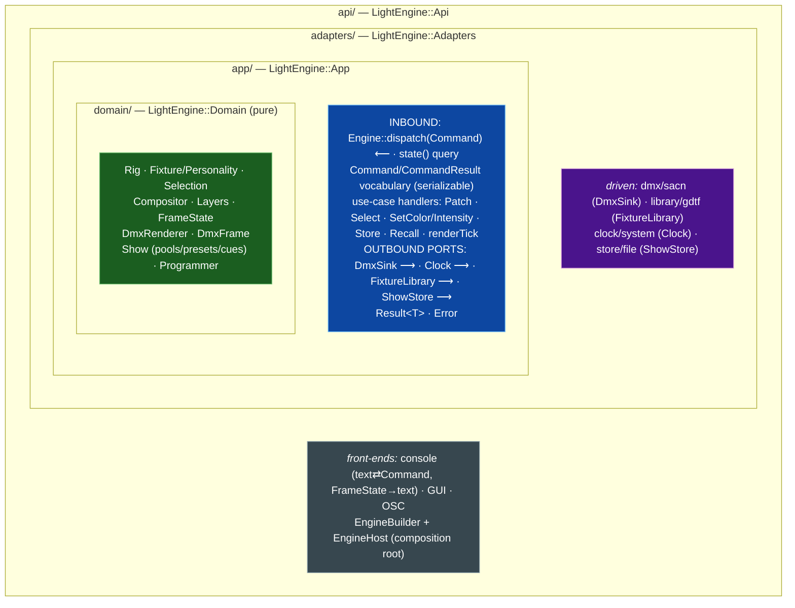
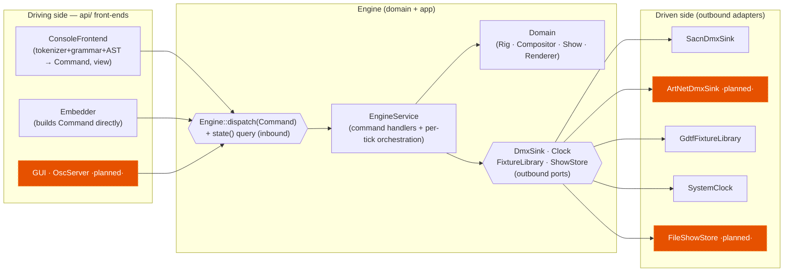
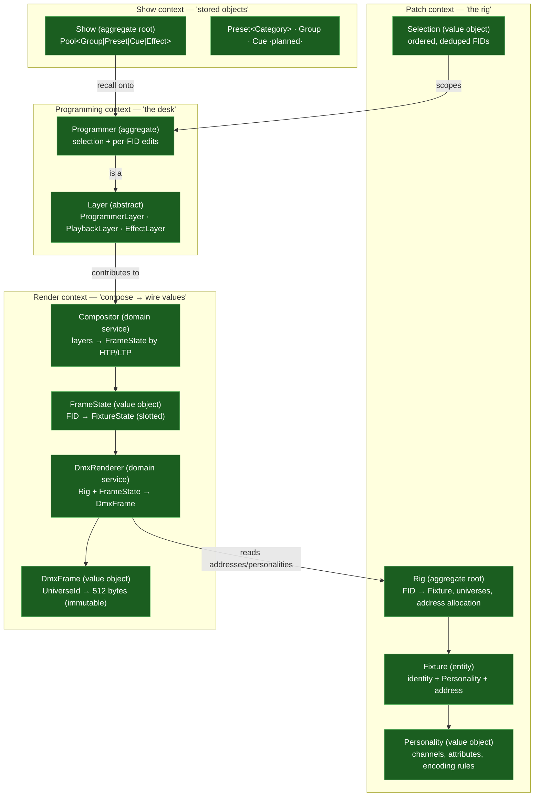
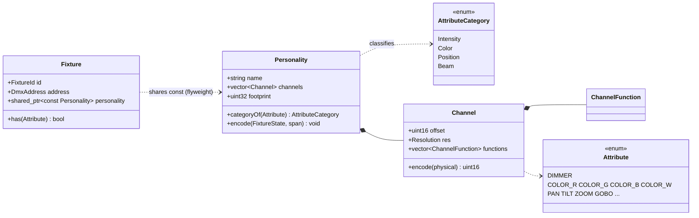
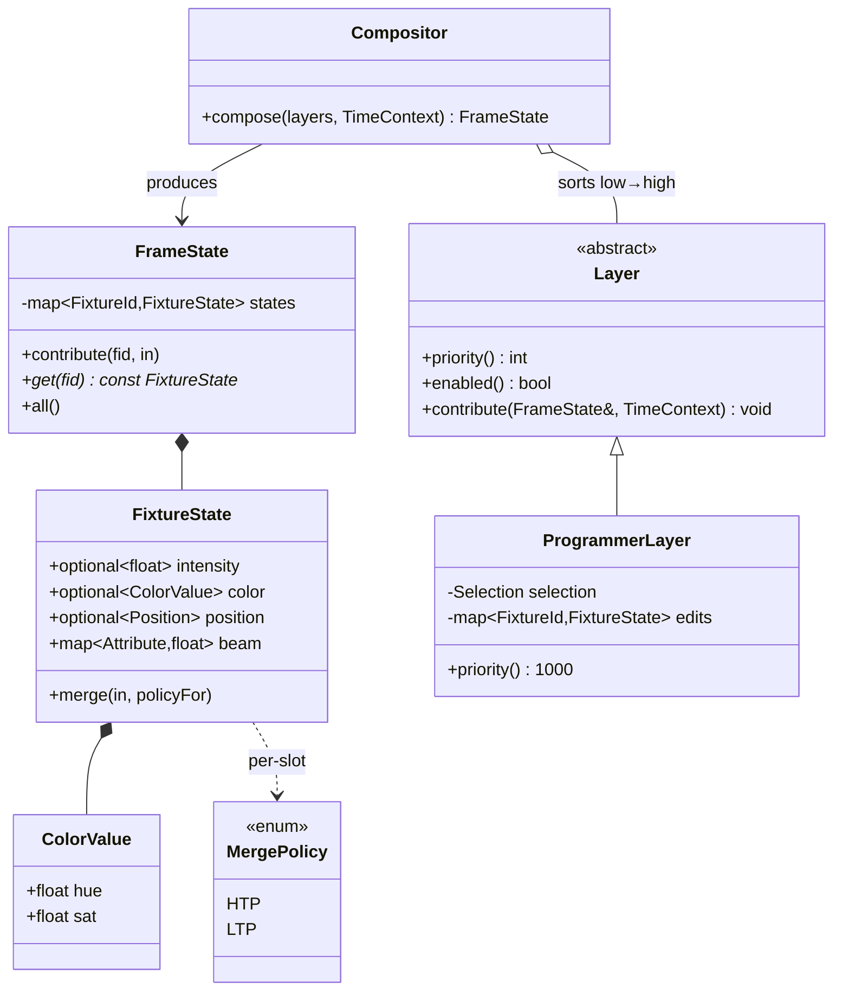
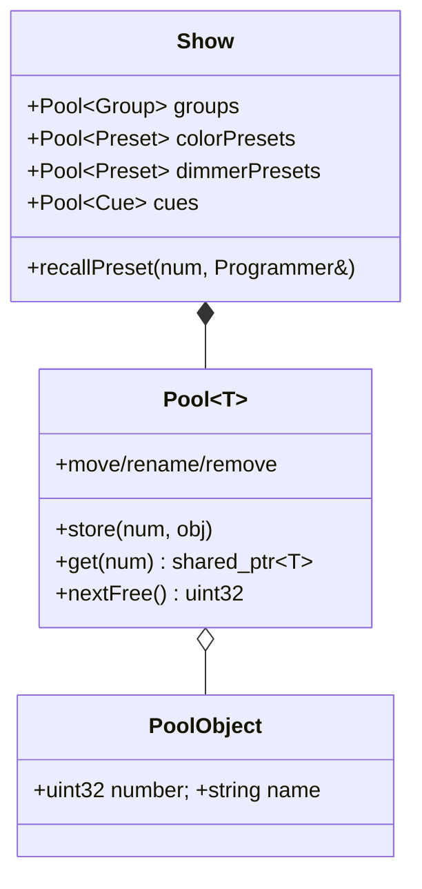
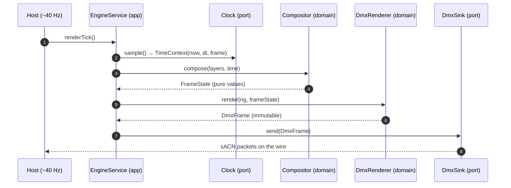
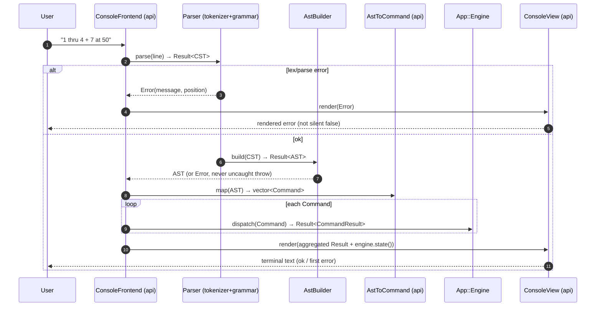
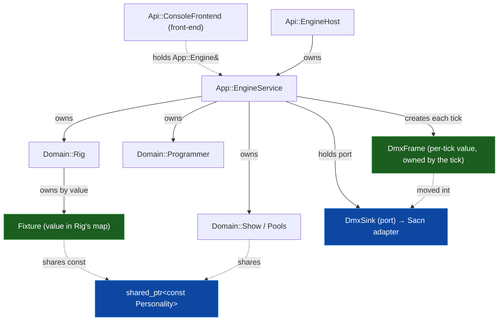

# Target Architecture — Zoom Levels

Outside-in, same as [`../lulcek/ARCHITECTURE.md`](../lulcek/ARCHITECTURE.md), so
the two read as before/after of the same system:

- [Level 1 — Boundaries & the dependency rule](#level-1--boundaries--the-dependency-rule)
- [Level 2 — The hexagon (ports & adapters)](#level-2--the-hexagon-ports--adapters)
- [Level 3 — Bounded contexts inside the domain](#level-3--bounded-contexts-inside-the-domain)
- [Level 4 — The domain model (class diagrams)](#level-4--the-domain-model-class-diagrams)
- [Pipelines — pure render & command](#pipelines--pure-render--command)
- [Ownership & lifetime](#ownership--lifetime)

---

## Level 1 — Boundaries & the dependency rule

Four rings. **Source dependencies point inward only.** Nothing in an inner ring
names a type from an outer ring; when an inner ring needs the outer world it
declares a **port** (an interface it owns) and the outer ring implements it.
This is the Clean/Onion "dependency inversion at the boundary" applied to the
hexagon.



**Reading it:** the domain sits at dead centre and compiles against nothing but
itself and the color shared-kernel. The application wraps it with use-cases,
exposes a single **inbound command bus** (`Engine::dispatch(Command)`), and
declares every *outbound* interface to the outside world. Driven adapters and
the api front-ends live outside and depend inward — the console's parser and all
UI text/serialization sit in `api/`, not the core. The **linker** enforces this:
`le_domain`/`le_app` link no network, filesystem, *or parser* symbols, so a
violation fails to build.

### The dependency rule, concretely

| If you are editing… | you may `#include` from… | you may **not** `#include` from… |
|---------------------|--------------------------|----------------------------------|
| `domain/` | `domain/`, `Utils/Colors` | `app/`, `adapters/`, `api/`, `Utils/Network`, `Syntax/` |
| `app/` | `app/`, `domain/`, `Utils/Colors` | `adapters/`, `api/`, `Utils/Network`, `Syntax/` |
| `adapters/` *(driven)* | `app/` (outbound ports), `domain/`, everything external | `app/command/` internals, *another adapter's internals* (adapters are siblings) |
| `api/` *(front-ends + root)* | `app/` (`Engine`, `Command`), `adapters/`, `domain/`, `Syntax/` | — (it is the outermost ring / composition root) |

> **Contrast with today.** The current stack (`GDTF ← Fixture ← DMX ← Engine ←
> Commands`) is also acyclic and inward-pointing (`../lulcek` G1) — the
> improvement is *not* "add layering", it is **which axis we cut on**. Today the
> cut is by technical kind, so the network sink and the file-loading command
> parser sit *inside* the same `Engine`/`Commands` layers as the pure
> compose/merge logic. The new cut puts a hard, linker-checked wall between
> *pure policy* and *I/O*.

---

## Level 2 — The hexagon (ports & adapters)

The core exposes two kinds of port. Full signatures are in [PORTS.md](PORTS.md);
here is the shape.



- **Inbound — the command bus (`Engine::dispatch(Command)`).** A single entry
  point taking a serializable `Command` value: select, set intensity/color,
  store, recall, delete, clear, patch. The console front-end is the first thing
  that speaks it (parsing text into `Command`s); an embedder, a GUI, and (later)
  OSC/MIDI/REST build the *same* `Command`s. This is where today's
  `CommandExecutor → Engine&` coupling is broken: the executor becomes a pure
  `AST → Command` mapper that calls `App::Engine::dispatch`, and it lives in
  `api/console`, not the core. The engine has **no** UI-shaped public verbs.
- **Outbound (driven) ports** — the things the engine needs *done for it*:
  - `DmxSink` — "here is an immutable `DmxFrame`, put it on the wire."
  - `Clock` — "what is `now` / how much time elapsed" (already injectable via
    `update(dt)`; now a named port with a `ManualClock` fake, formalising G3).
  - `FixtureLibrary` — "give me the personality named `X`" (turns the empty
    `FixtureLibrary` stub, `../lulcek` A12, into a real seam).
  - `ShowStore` — "persist / load the show" (new; enables save/load without
    touching the domain).

The `EngineService` never sees sACN, GDTF files, the clock's syscalls, *or a
line of console text* — only `Command` values coming in and these outbound
interfaces going out. That is exactly what makes it unit-testable with fakes,
and what lets a GUI reuse it without pretending to be a console.

---

## Level 3 — Bounded contexts inside the domain

The domain is not one flat bag of classes. It splits into four cohesive
sub-models with a clear language each. This is the DDD "bounded context" idea at
module granularity (they share one process, so they are contexts-as-packages,
not separate services).



| Context | Aggregate root | Invariant it protects |
|---------|----------------|-----------------------|
| **Patch** | `Rig` | Every FID maps to exactly one fixture; no two fixtures overlap a DMX address; a personality's footprint fits its universe |
| **Programming** | `Programmer` | Edits are scoped to the live selection; clearing is staged (values vs selection), console-style |
| **Show** | `Show` | Numbered slots are unique per pool; names index back to numbers; recall targets only patched FIDs |
| **Render** | *(services, no root)* | `FrameState`/`DmxFrame` are immutable outputs; rendering is a pure function of `(Rig, FrameState)` |

> The **value-slot fix** (`../lulcek` A2/A4/A11) lands in the Render context:
> `FixtureState` gets **independent slots** — `intensity` (HTP), `color` (LTP),
> `position` (LTP), `beam` — instead of one `HSV` that conflates intensity with
> hue/sat. An `Attribute → Category` classifier decides which slot and which
> merge policy each attribute uses. See the next level.

---

## Level 4 — The domain model (class diagrams)

### 4.1 — Fixture & Personality (pure, no buffer pointer)

The single biggest change. `Fixture` becomes an **entity with identity + a
shared `Personality`**; it no longer holds a `uint8_t* bytes`. `Personality`
(today's flyweight `LogicalChannel` set) owns the **encoding rule** as a *pure
function*, so the same logic that lives in `Parameter::WriteRaw` /
`ColorCell::Resolve` today moves here — but writing into a caller-supplied
`DmxFrame`, never a borrowed pointer.



- `Personality::encode(FixtureState, span)` replaces the
  `Fixture::Resolve → ColorCell::Resolve → Parameter::WriteRaw` chain. `span` is
  a **mutable view** (`std::span<uint8_t>`) into the `DmxFrame` region this
  fixture occupies — handed in by the renderer, owned by the frame, valid only
  for the call. No stored pointer, so the copy-ctor gymnastics (G6) simply
  vanish.
- The virtual-dimmer rule and the HSV→RGB(+W) conversion (today in `ColorCell`)
  become pure methods on `Personality`/a `ColorMixer` helper — same math,
  now unit-testable in isolation (`../lulcek` A9 becomes a testable seam).

### 4.2 — Composition core (FrameState with slotted values)



- **Intensity is now its own HTP slot**; color is LTP; they no longer ride the
  same `HSV`. This is the fix `../lulcek` calls the keystone (A2). The merge
  policy is chosen **per category** by the classifier, not per whole-fixture.
- `Compositor::compose(layers, time) → FrameState` is a **pure function** —
  give it a list of layers and a `TimeContext`, get back a value map. No engine,
  no patch, no I/O. This is the single most valuable test target in the system.
- `Layer` is unchanged in spirit (today's `Layer`/`ProgrammerLayer`), but
  `apply(Frame&, ...)` becomes `contribute(FrameState&, ...)` and lives in
  `domain/compose`, not `Engine/`.

### 4.3 — Rig & DmxRenderer (values → immutable frame)

```mermaid
classDiagram
    direction LR

    class Rig {
        -map~FixtureId,Fixture~ fixtures
        -AddressAllocator alloc
        +patch(Personality, universe, count, ...) vector~FixtureId~
        +fixture(FixtureId) const Fixture*
        +select(...) Selection
        +universes() ...
    }
    class DmxFrame {
        -map~UniverseId,array~ buffers
        +span(UniverseId, offset, len) span~uint8~
        +universe(UniverseId) const array~512~&
        +blackout()
    }
    class DmxRenderer {
        +render(Rig, FrameState) DmxFrame
    }
    class AddressAllocator {
        +place(footprint, universe, hint) DmxAddress
    }

    DmxRenderer ..> Rig : reads personalities+addresses
    DmxRenderer ..> DmxFrame : writes &amp; returns
    Rig *-- AddressAllocator
```

- `Rig` is today's `Patch`, but **owns no byte buffer** and does **not inherit**
  `FragmentedStorage`. `AddressAllocator` wraps the packing logic
  (`FragmentedStorage` can be its private implementation), exposing only the
  wired, safe surface — closing the leaky-base-class foot-gun (`../lulcek` A10).
- `DmxRenderer::render(rig, frameState) → DmxFrame` is the **pure encoder**: for
  each fixture in the frame state, ask its personality to encode into the frame
  region at its address. Deterministic, allocation-bounded, no network. The
  `DmxFrame` it returns is an immutable value handed to the `DmxSink` port.
- The old per-frame "blackout the buffer, resolve into it, send it" becomes
  "build a fresh `DmxFrame`, hand it to the sink" — the **non-tracking model
  (G2) is preserved**, but the transient is now an owned value, not a mutated
  shared buffer.

### 4.4 — Show (stored objects) & the generic Pool

Essentially unchanged from today's excellent `Pool<T>` (G7) — it just moves into
`domain/show` and gains a `Show` aggregate root that owns the pools and enforces
cross-pool invariants (rename uniqueness, recall-target validity).



---

## Pipelines — pure render & command

### The per-tick render pipeline (now a use-case + pure core)



Everything between `compose` and `render` is a **pure function of injected
inputs**. The only I/O — sampling the clock and pushing the frame — sits behind
ports, so a test drives `renderTick()` with a `ManualClock` and a
`RecordingDmxSink` and asserts on the exact bytes produced. Compare today's
`Engine::update()` (`src/Engine/Engine.cpp:127`), which blacks out shared
buffers, mutates fixtures in place, and calls `m_output.sendAll` on a concrete
sACN sender — untestable without the network.

> **Dirty-set resolution (`../lulcek` A3).** The vestigial `m_dirty` machinery is
> dropped from the core. If on-change sending is ever wanted, it becomes a
> *decorator adapter* on `DmxSink` (compare successive `DmxFrame`s, skip
> unchanged universes) — a pure, testable policy outside the domain.

### The command pipeline (driver → inbound port)



Three changes from today (`../lulcek/PIPELINES.md`):

1. **The whole pipeline moved to `api/console` — it is a front-end, not core.**
   Tokenizer, grammar, AST builder, the AST→`Command` mapper, and the
   `ConsoleView` that renders results all live in `api/`; `le_domain`/`le_app`
   never link the parser. The engine's boundary is the `Command`, not text.
2. **The executor emits `Command` *values* and calls `Engine::dispatch`, not
   `Engine&` methods.** It is a pure `AST → Command` translator: build the
   `Command` vector in a test and assert on it with zero engine, or dispatch it
   against a spy `Engine`. Any new front-end (OSC, REST, GUI) builds the *same*
   `Command`s — the console's grammar is just one way to author them.
3. **Errors are values, not silent `false` or uncaught `throw`** (`../lulcek`
   A5). `parse`/`build` return `Result<T, Error>`; `AstBuilder` returns an
   `Error` instead of `throw std::runtime_error`; the front-end's `ConsoleView`
   renders it. The grammar/token/AST-spec data-file design (G4) is otherwise
   kept verbatim.

---

## Ownership & lifetime

The redesign deletes the trickiest ownership question in the codebase — *"who
re-wires the non-owning `Parameter::bytes` pointers on copy?"* — by removing
those pointers entirely.



**Key facts**

- **No fixture holds a pointer into any DMX buffer.** The only buffer is inside
  the transient `DmxFrame`, created fresh per tick and *moved* into the sink.
  Fixtures are plain values; copying one copies its identity + address + a
  shared `const Personality` — trivially correct, no index rebuild.
- **`Personality` stays a flyweight** (`shared_ptr<const>`) — the good part of
  G5 is retained; hundreds of fixtures share a handful of immutable
  personalities.
- **The `Programmer` is one aggregate, held by the `EngineService`.** It is a
  `Layer` fed to the `Compositor`, not a raw `Layer*` in a hand-managed vector.
  External layers register through a small owning handle
  (`std::vector<std::unique_ptr<Layer>>` or a `LayerHandle`), closing the
  dangling-`Layer*` hole (`../lulcek` A1).
- **Front-ends never own the engine.** A `ConsoleFrontend` (or a GUI) holds a
  non-owning `App::Engine&` handed out by `EngineHost`; it dispatches `Command`s
  and reads `state()`, but the engine and its ports outlive any front-end and
  can run headless with none attached.
- **Ports are held by reference/interface**, wired once at the composition root
  (`EngineBuilder`, see [PORTS.md](PORTS.md)). The engine never `new`s an
  adapter.

---

## Where this leaves the `../lulcek` issue list

| Issue | Status under this architecture |
|-------|--------------------------------|
| A1 · layer ownership (raw `Layer*`) | **Fixed** — owning `Layer` handles in the compositor |
| A2 · intensity/color conflated | **Fixed** — slotted `FixtureState` (§4.2) |
| A3 · vestigial dirty set | **Removed** from core; optional on-change decorator on `DmxSink` |
| A4 · stub attribute vocabulary | **Enabled** — `Attribute` + `AttributeCategory` classifier is the seam |
| A5 · thin/inconsistent errors | **Fixed** — `Result<T>`/`Error` across app + command adapter |
| A6 · CWD-relative resource paths | **Fixed** — asset root injected into the command adapter |
| A7 · no tests | **Fixed** — see [TESTABILITY.md](TESTABILITY.md) |
| A9 · naive RGBW | Isolated as a testable `ColorMixer` seam (math unchanged) |
| A10 · `Universe` inherits storage | **Fixed** — `Rig`/`AddressAllocator` compose it privately |
| A11 · dimmer coupled to color | **Fixed** — independent intensity slot |
| A12 · stubs advertised as seams | `FixtureLibrary` becomes a real driven port + adapter |
| A13 · concurrency undocumented | Ports make the seam explicit; a command queue is an adapter concern |
| A14 · per-frame alloc/sort churn | `DmxFrame`/`FrameState` storage reusable; layers sorted on mutation, not per tick |

Strengths **G1–G7 are all preserved or strengthened** — see each `../lulcek`
cross-reference above. The redesign is a re-seating, not a rewrite.
</content>
