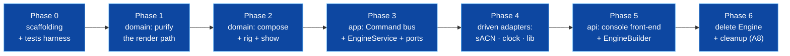

# Migration — From Today's Tree to the Target

This is the step-by-step plan to move the current codebase (`commands` branch)
to the [ARCHITECTURE.md](ARCHITECTURE.md) design **without a big-bang rewrite**.
It is a **strangler migration**: the new structure grows *around* the running
system, each phase compiles and the examples keep running, and the old
`Engine` is only deleted once nothing depends on it.

Guiding rules for every phase:

- **The build stays green and `LightEngine_demo` / `LightEngine_commands` keep
  producing the same output** at the end of each phase (regression guard).
- **Move behaviour, don't rewrite it.** The compose model (G2), the pool
  template (G7), the command data-file pipeline (G4), and the HSV math (with its
  known A9 approximation) are lifted as-is; correctness fixes (A2/A5/A10) are
  called out where they happen.
- **One boundary per phase**, inner-ring first, so each new ring only depends on
  rings that already exist.

Effort is a rough T-shirt size; the phases are sequenced by dependency, not size.

---

## Phase 0 — Scaffolding & the safety net *(S)*

**Goal:** make later moves safe and cheap. No behaviour change.

1. **Repo hygiene first** (`../lulcek` A8, quick wins that de-noise every later
   diff): delete the stray `brightness` file, `CMakePresetsold.json`, and
   dead commented blocks (e.g. the disabled loop in `examples/demo/main.cpp`,
   the duplicate `Pool::contains`).
2. **Add a test harness** *before* moving code, so moves are verified by tests,
   not by eyeball. Add GoogleTest/Catch2 via `FetchContent`, `enable_testing()`,
   a `tests/` tree, and one trivially-passing test per intended ring target.
3. **Characterisation tests on today's behaviour.** Capture the current
   `examples/demo` and `examples/commands` stdout as golden files and assert on
   them. This is the regression oracle for the whole migration.
4. **Split `utils` if feasible** into `utils_colors` (pure) and `utils_net`
   (I/O). If the submodule can't be changed yet, add a CI `grep` check that
   fails if `domain/`/`app/` sources include `Utils/Network` or `Syntax/` — an
   interim boundary guard until the link split lands.
5. **Create the empty ring directories** and four CMake targets
   (`le_domain`, `le_app`, `le_adapters`, `le_api`) as described in
   [PORTS.md](PORTS.md#directory--cmake-layout), each initially empty and linked
   into the existing `LightEngine` target. The dependency edges are declared now
   so violations fail to link as soon as code lands.

**Exit:** `ctest` runs, golden tests pass, empty ring targets build.

---

## Phase 1 — Purify the render path (the keystone) *(L)*

**Goal:** remove the domain↔wire coupling — the thesis. This is the hardest and
highest-value phase; everything else is easier afterward.

1. **Introduce `DmxFrame`** (`domain/render`): an owned `map<UniverseId,
   array<uint8_t,512>>` with `span(uni, offset, len)`, `universe(uni)`,
   `blackout()`. Pure value type.
2. **Introduce `Personality`** (`domain/fixture`) from today's `LogicalChannel`
   set: same channels/functions, kept as a `shared_ptr<const>` flyweight (G5).
   Move `Parameter::Write`'s physical→DMX range math and `DMXChannel` 8/16-bit
   packing into `Channel::encode(...)` / `Personality::encode(state, span)`.
   **This is a lift of the existing math**, now writing into the passed-in
   `span` instead of `m_bytes[m_baseOffset + addr]`.
3. **Move the HSV→RGB(+W) + virtual-dimmer rule** out of `ColorCell::Resolve`
   into a pure `ColorMixer` (still `domain/fixture`). Same formula (A9
   approximation retained, now behind a named seam).
4. **Introduce `FixtureState`** with the **split slots** (intensity/color/
   position/beam) and an `Attribute → AttributeCategory` classifier. This is the
   A2/A4/A11 fix; do it here because the renderer needs the slots.
5. **Introduce `DmxRenderer::render(rig-lite, frameState) → DmxFrame`.** At this
   phase `rig-lite` can be a thin shim over the existing `Patch` (adapter
   method that yields `{FixtureId, Personality, DmxAddress}` triples) so you can
   land the renderer before rewriting `Patch`.
6. **Unit-test #2 and #3 from [TESTABILITY.md](TESTABILITY.md)** against the new
   renderer/mixer. These are the tests that were impossible before.
7. **Bridge, don't cut yet:** keep `Fixture`/`Parameter`/`ColorCell`/`Universe`
   alive; have `Engine::update()` optionally build a `FrameState`, render a
   `DmxFrame`, and (temporarily) copy it into the existing universe buffers so
   the sACN path is unchanged. Assert the golden DMX dump is byte-identical.

**Exit:** the value→bytes encoding exists as a pure, tested function; demo output
byte-identical to the golden.

> **Why first:** until the renderer is pure, the domain can't be extracted from
> the buffer, and no domain test can avoid standing up a `Universe`. Every later
> phase depends on this seam.

---

## Phase 2 — Extract the rest of the domain *(M)*

**Goal:** the domain compiles as `le_domain` with **zero** app/adapter/network
includes.

1. **`Rig`** (`domain/rig`) from `Patch`: keep the FID map, universe map, and
   placement logic, but **compose** `FragmentedStorage` inside an
   `AddressAllocator` instead of `Universe : public FragmentedStorage`
   (fixes A10). `Rig` owns `Fixture` values; no byte buffers live here anymore.
2. **`Selection`** from `DMX::FixtureGroup` (pure ordered/deduped FIDs).
3. **`Compositor` + `Layer`/`ProgrammerLayer`** (`domain/compose`) from
   `Engine`'s compose loop + `Layer.h`: `apply(Frame&, time)` becomes
   `contribute(FrameState&, time)`; the low→high sort and enabled-check move
   into `Compositor::compose(layers, time)`. Sort **on mutation**, not per tick
   (A14).
4. **`Programmer`** (`domain/programmer`) from `ProgrammerLayer`'s edit/selection
   state, now speaking `FixtureState` slots.
5. **`Show` + `Pool<T>` + presets** (`domain/show`) — move `Stored`, `Pool`,
   `Group`, `Preset` almost verbatim (G7 is already good); add the `Show`
   aggregate root over the pools.
6. **Port unit tests** for compose (#1), pool numbering, rig addressing/clash.

**Exit:** `le_domain` links only `utils_colors`; domain unit tests pass; `Engine`
now delegates its compose/render/store to domain types internally (still the old
public surface).

---

## Phase 3 — The command bus & ports *(M)*

**Goal:** the `Command` vocabulary, the use-case handlers, and the interfaces to
the outside world exist as `le_app`, depending only on `le_domain`.

1. **Define the `Command`/`CommandResult` vocabulary** (`app/command`) and the
   supporting value types (`Selector`, `ObjectRef`, `PresetKind`,
   `PatchOptions`) — signatures from [PORTS.md](PORTS.md). These are plain,
   serializable structs.
2. **Define the inbound `Engine` interface** (`app/Engine.h`: `dispatch` +
   `state()` + `renderTick()`) and the **outbound ports** (`app/ports`):
   `DmxSink`, `Clock`, `FixtureLibrary`, `ShowStore`.
3. **Add `Result<T>`/`Error`** (`app`) and return it from `dispatch` and the
   handlers (A5). (`AstBuilder`'s `throw` becomes a returned `Error` in Phase 5,
   when the parser moves into the front-end.)
4. **`EngineService`** implements `Engine` and holds the domain aggregates
   (`Rig`, `Programmer`, `Show`, `Compositor`) plus the outbound ports by
   interface. `dispatch(Command)` is a `std::visit` over the variant; each arm
   is a use-case body lifted out of today's `Engine`
   (`storeColorPreset`/`recallDimmerPreset`/`selectGroup`/`clear`/`patch` →
   handler arms returning `Result<CommandResult>`). `renderTick()` becomes the
   orchestration: `clock.sample()` → `compositor.compose()` →
   `renderer.render()` → `sink.send()`.
5. **Owning layer handles** (A1): `EngineService` holds
   `vector<unique_ptr<Layer>>` (+ the programmer), replacing the raw
   `vector<Layer*>` and the dangling-pointer hazard.
6. **App tests** with fakes: the full-tick test (#4) and `dispatch`-level
   use-case tests (build a `Command`, assert the resulting `state()` / recorded
   sink), no parser involved.

**Exit:** `le_app` links only `le_domain`; `EngineService` fully implements the
desk behaviour behind `dispatch` + ports; the old `Engine` can now be a **thin
shim** that owns an `EngineService` + concrete adapters (kept only for the old
examples until Phase 5).

---

## Phase 4 — Driven adapters *(M)*

**Goal:** every *outbound* I/O concern is a driven adapter implementing a port.
(The command parser is **not** here — it is a front-end, moved in Phase 5.)

1. **`SacnDmxSink`** (`adapters/dmx`) implementing `DmxSink` from `DMXOutput` +
   `Utils::Network::SACN`. It receives a `DmxFrame` and translates it to
   packets — the temporary "copy DmxFrame back into Universe buffers" bridge
   from Phase 1 is **deleted here**, closing the loop.
2. **`RecordingDmxSink`** (test adapter) + the **`DmxSink` contract test**
   (#5) run against both.
3. **`SystemClock` / `ManualClock`** (`adapters/clock`) implementing `Clock`.
4. **`BuilderFixtureLibrary`** (`adapters/library`) implementing
   `FixtureLibrary` over the existing `FixtureBuilder`; it translates a
   personality *name* into a `Personality`, wiring the name-based patch that
   `Patch.h:45` had stubbed out (now reached via `dispatch(Patch{name,…})`).

**Exit:** all driven adapters implement their ports; contract tests green;
`le_adapters` links `le_app` + external I/O only.

---

## Phase 5 — API: front-ends & composition root *(M)*

**Goal:** the console becomes a front-end that translates text ⇄ `Command`; a
clean public surface; embedders stop reaching into internals.

1. **Console front-end** (`api/console`): move `CommandParser`, `AstBuilder`,
   the `commands.syn/txt/spec` data files, and the executor here. **Re-point the
   executor at `App::Engine&`**: instead of calling verb methods it now maps
   `AST → App::Command` and calls `dispatch` (this is the decoupling). Convert
   `AstBuilder`'s `throw` into a returned `Error` (A5). Load grammar/token files
   from an injected **asset root** (fixes A6).
2. **`ConsoleView`** (`api/console`): the outbound half — render
   `Engine::state()` (`FrameState`) and each `Result<CommandResult>` into
   terminal text. All stdout printing scattered through today's `Engine`/`main`
   lands here.
3. **`EngineBuilder`** (`api`): the only place driven adapters are `new`ed and
   wired into an `EngineService`, returning an `EngineHost` (see
   [PORTS.md](PORTS.md#composition-root--enginebuilder)).
4. **Rewrite `examples/demo` and `examples/commands`** onto `Api::EngineBuilder`
   + `Api::ConsoleFrontend` (the snippet in PORTS.md). This proves the public
   surface is sufficient and is the final regression check against the Phase 0
   goldens.
5. **`AssetPaths::relativeTo(argv[0])`** so the examples find grammar files from
   the binary location, not the repo root.

**Exit:** the parser lives in `le_api` only (`le_domain`/`le_app` link no
`synparser`); examples use only `api/` headers; golden output matches Phase 0.

---

## Phase 6 — Delete the old engine & finalise *(S)*

**Goal:** remove the strangled scaffolding; enforce the boundaries permanently.

1. **Delete `Engine`, `Patch`, `Universe`, `Fixture`/`Parameter`/`ColorCell`,
   `Frame`, `DMXOutput`** and any bridge shims — nothing should reference them
   now. (Their behaviour lives in `domain/` + `adapters/`.)
2. **Flip the boundary guard from advisory to enforced:** `le_domain`/`le_app`
   must not link `utils_net`/`synparser`; keep the CI `grep`/`include-what-you-
   use` check as belt-and-braces.
3. **Retire the dirty-set** entirely (A3); if on-change output is wanted, add it
   as a `DmxSink` decorator adapter (pure, testable).
4. **Documentation:** fold `docs/lulcek-but-better` into the live docs, update
   `docs/ENGINE.md` / the PUML diagrams, and mark the `../lulcek` assessment
   issues resolved.

**Exit:** the tree matches [ARCHITECTURE.md](ARCHITECTURE.md); the `../lulcek`
issue table is closed out per the matrix at the end of ARCHITECTURE.md.

---

## File-move cheat-sheet

Concrete origin → destination, for reference during the phases:

| Today | Phase | Target |
|-------|:-----:|--------|
| `GDTF/LogicalChannel.h`, `DMXChannel.h`, `Ranges.h` | 1 | `domain/fixture` (`Personality`, `Channel`, `ChannelFunction`) |
| `Fixture/Parameter.h` (`WriteRaw`) | 1 | `domain/fixture` `Channel::encode` / `Personality::encode` (into a `span`) |
| `Fixture/ColorCell.h` | 1 | `domain/fixture` `ColorMixer` |
| `Engine/Frame.h` (`FixtureValues`, `MergePolicy`) | 1–2 | `domain/compose` (`FrameState`, slotted `FixtureState`) |
| — (new) | 1 | `domain/render` (`DmxFrame`, `DmxRenderer`) |
| `Engine/Patch.h` | 2 | `domain/rig` (`Rig`, `AddressAllocator`) — **compose** storage |
| `DMX/Universe.h` (buffer + packing) | 2 | split: addressing → `domain/rig`; bytes → `domain/render` `DmxFrame` |
| `DMX/FixtureGroup.h` | 2 | `domain/rig` `Selection` |
| `Engine/Layer.h` | 2 | `domain/compose` `Layer`/`ProgrammerLayer`; `domain/programmer` `Programmer` |
| `Engine/Pools/*`, `Stored.h` | 2 | `domain/show` (`Show`, `Pool`, `Group`, `Preset`) |
| `Engine/Engine.cpp` use-cases (verb methods) | 3 | `app/EngineService::dispatch` handler arms (returning `Result<CommandResult>`) |
| `Engine/Engine.cpp` `update()` | 3 | `app/EngineService::renderTick()` |
| — (new) | 3 | `app/command/*` (`Command`, `CommandResult`, `Selector`…), `app/Engine.h`, `app/ports/*`, `app/Result.h`, `app/Error.h` |
| `Engine/DMXOutput.*` | 4 | `adapters/dmx/SacnDmxSink` (`DmxSink`) |
| `Engine/TimeContext.h` | 3/4 | `app` `TimeContext` + `adapters/clock` `SystemClock`/`ManualClock` |
| `Engine/FixtureLibrary.h`, `FixtureBuilder.h` | 4 | `adapters/library/BuilderFixtureLibrary` (`FixtureLibrary`) |
| `Commands/*`, `data/*.syn|txt|spec` | 5 | `api/console` (executor maps `AST → App::Command`, calls `Engine::dispatch`) |
| stdout/status printing in `Engine`/`main` | 5 | `api/console` `ConsoleView` (renders `FrameState` + `Result`) |
| `Engine/Engine.h` public facade | 5 | `api/EngineBuilder` + `api/EngineHost` |
| `examples/*/main.cpp` | 5 | rewrite onto `Api::EngineBuilder` + `Api::ConsoleFrontend` |

---

## Risk register

| Risk | Mitigation |
|------|------------|
| Encoding drift when lifting `WriteRaw`/`ColorCell` into pure code | Phase 1 bridge keeps sACN output byte-identical; golden DMX-dump assertion catches any drift |
| Slot split (A2) changes merge results for existing shows | Land it in Phase 1 behind the goldens; the demo has one color-producing layer, so results should match — document any intended change |
| `utils` can't be split into colors/net cheaply | Interim CI `grep` boundary guard (Phase 0.4) until the link split is possible |
| Big surface change breaks embedders mid-migration | Old `Engine` facade survives through Phase 4 as a shim; only removed in Phase 6 |
| GDTF import scope creep | Out of scope — `FixtureLibrary` port + `BuilderFixtureLibrary` ship first; `GdtfFixtureLibrary` is a later, isolated adapter with zero core impact |

---

## Definition of done

- Four ring targets; `le_domain`/`le_app` link no network/parser code (enforced).
- `ctest` green: domain unit + per-port contract + a few integration tests.
- `examples/` build on `api/` only and match the Phase 0 golden output.
- `../lulcek` issues A1, A2, A3, A4, A5, A6, A7, A10, A11 closed; A9/A13/A14
  isolated as documented seams.
- The old `Engine`/`Patch`/`Universe`/`Fixture`-buffer path is deleted.
</content>
