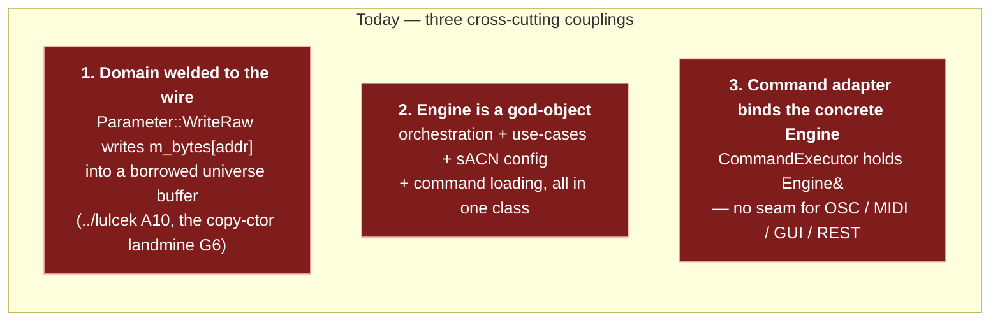
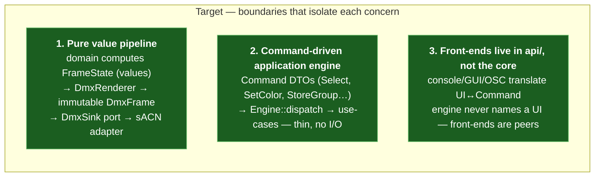
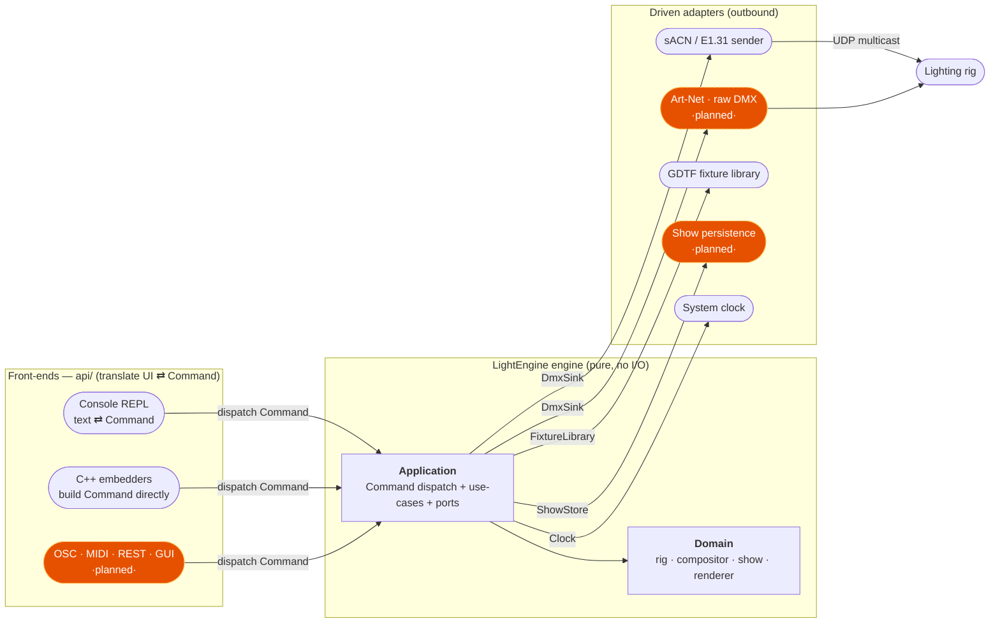
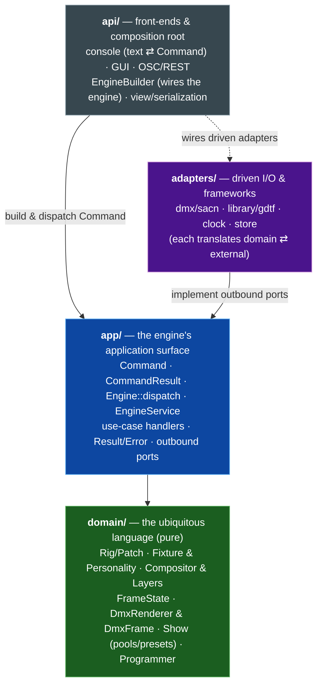

# LightEngine — Target Architecture ("but better")

> A re-architecture proposal for the LightEngine DMX console, moving from a
> **technically-layered stack** to a **domain-driven, ports-and-adapters
> (hexagonal)** design with hard boundaries between **domain**, **application**,
> **adapters**, and **api**.

This folder is the successor to [`../lulcek`](../lulcek), which documents the
system *as it stands today*. Read that first — this proposal repeatedly refers
back to its findings (the `A1…A14` issues and `G1…G7` strengths).

Nothing here throws away the good bones. The current stack has a **strict,
acyclic layering** (`../lulcek/ASSESSMENT.md` G1), a **non-tracking frame
compositor** (G2), a **deterministic injectable clock** (G3) and a **clean
text→AST→executor command pipeline** (G4). The redesign *keeps all four* and
re-seats them inside boundaries that make each independently testable and
independently replaceable.

---

## Documents

| Doc | What's inside |
|-----|---------------|
| **[README.md](README.md)** (this file) | The thesis, system context, the four-boundary module map, old→new at a glance |
| **[ARCHITECTURE.md](ARCHITECTURE.md)** | The target design in zoom levels: boundaries → the hexagon → the domain model → pipelines → bounded contexts |
| **[PORTS.md](PORTS.md)** | The port catalogue (inbound + outbound interfaces, with C++ signatures) and the adapters that implement them |
| **[TESTABILITY.md](TESTABILITY.md)** | What the boundaries unlock: the test pyramid, fakes-for-ports, and worked test examples |
| **[MIGRATION.md](MIGRATION.md)** | The incremental, build-green-every-step plan to get from today's tree to this one |

---

## The thesis in two lines

> **1. Push the wire out of the domain.** Today a `Fixture` writes raw DMX bytes
> through a non-owning pointer into a live universe buffer. Make the domain
> compute *values*, make a pure renderer turn values into an immutable DMX
> frame, and make sACN just one adapter behind a port.

> **2. The engine speaks commands, not consoles.** The core (domain + app) is a
> pure, headless **engine** whose *only* inbound vocabulary is a serializable
> `Command`. It does not know a text console, a GUI, or a network client exists.
> Every front-end lives in `api/` and does its own translation: **UI input →
> `Command` → `engine.dispatch()`**, and **engine read-model → console text /
> serialized bytes** on the way back out.

Together these separate three things that are welded today: **what the show
should look like** (domain values), **how it reaches the wire** (a driven
adapter behind a port), and **how an operator expresses intent** (an api-layer
front-end that speaks `Command`). Everything else — an application layer of
use-cases, a swappable output protocol, a GUI that reuses the CLI's engine
verbatim, a real test suite — follows from those two moves.

> **"The engine" = `domain/` + `app/`.** Throughout these docs, *engine* means
> the two inner rings taken together: pure policy (`domain`) wrapped by
> command-executing use-cases and port interfaces (`app`). It links no I/O and
> names no UI. `api/` (front-ends) and `adapters/` (infrastructure) sit outside
> it and depend inward.

### Why the current shape resists this

The current code is layered by **technical kind** (GDTF, Fixture, DMX, Engine,
Commands), and the layering is clean. But three couplings cut *across* those
layers and block testability and evolution:

- **`Parameter`/`ColorCell` alias the output buffer.** `Parameter::WriteRaw`
  writes into `m_bytes[m_baseOffset + ch.address]`, a raw pointer into the
  `Universe`'s 512-byte array (`include/LightEngine/Fixture/Parameter.h:86`).
  You cannot exercise fixture value logic without a live universe, and fixture
  **copy semantics become load-bearing** (the copy ctor must re-wire every
  pointer — the "subtle bit the code gets right", G6, is only *needed* because
  of this coupling).
- **`Engine` is a facade, an application service, and a composition root at
  once** (`include/LightEngine/Engine/Engine.h`). `storeColorPreset`,
  `setIP(sACN)`, `loadCommands(paths)`, and the `update()` render loop all live
  on the same class, so a use-case test drags in the network and the filesystem.
- **The command subsystem depends on the concrete `Engine`**
  (`CommandExecutor` holds `Engine&`, `include/LightEngine/Commands/CommandExecutor.h:23`).
  Any second driver (a network API, MIDI, OSC, a GUI) would have to depend on
  the same god-object rather than a small use-case interface.

### What the redesign does about it

---

## System context (hexagonal — Level 1)

Same actors as today, re-drawn so the **driving** side (who calls in) and the
**driven** side (what we call out to) sit on opposite faces of the core, each
across a **port**.

**The rule of the hexagon:** arrows only ever point *toward* the core.
Front-ends and adapters know the core; the core knows only its own **`Command`
vocabulary** and its **ports** (interfaces it defines). Swapping sACN for
Art-Net touches *one driven adapter*; swapping the console REPL for an OSC
server or a GUI touches *one api front-end* — both leave the engine untouched.

---

## The four boundaries (module map)

The tree reorganises from *five technical layers* into *four architectural
rings*. The dependency arrow always points inward.

| Ring | Namespace | May depend on | Contains | Knows about I/O? |
|------|-----------|---------------|----------|:---:|
| **domain** | `LightEngine::Domain` | *nothing* (only the shared kernel: color math) | Entities, value objects, aggregates, domain services, merge rules, DMX **encoding** | **No** |
| **app** | `LightEngine::App` | domain | The **`Command`/`CommandResult`** vocabulary, the `Engine` inbound interface (`dispatch` + read-model query), `EngineService`, use-case handlers, the per-tick orchestration, **outbound port interfaces**, `Result`/`Error` | No (only via ports) |
| **adapters** | `LightEngine::Adapters` | app (ports), domain (types) | *Driven only:* sACN sink, GDTF/builder library, clock, persistence — each translates domain ⇄ external | **Yes** |
| **api** | `LightEngine::Api` | app, adapters | *Front-ends:* console (text ⇄ `Command`, `FrameState` → text), GUI, OSC/REST; **plus** the `EngineBuilder` composition root and value (de)serialization. The only headers embedders include | Wires it |

> **Shared kernel.** `Utils::Colors` (HSV/RGB math) is pure and stays usable
> from the domain. `Utils::Network` (sACN/IP) is I/O and is only reachable from
> `adapters/`. `Utils::FragmentedStorage` becomes an implementation detail of a
> single domain address-allocator, *not* a base class that leaks its API
> (fixes `../lulcek` A10).

---

## Old → new at a glance

| Concept today | Where it lives now | Where it goes | Why |
|---------------|--------------------|---------------|-----|
| `GDTF::*` channel defs | `include/.../GDTF` | `domain/fixture` (Personality) | Immutable domain vocabulary |
| `Fixture` + `Parameter` + `ColorCell` (write to buffer) | `Fixture/` | `domain/fixture` **as pure value/encoder** | Stop aliasing the wire (thesis) |
| `Universe` **is-a** `FragmentedStorage` | `DMX/` | split: `domain/patch` (addressing) + `DmxFrame` value object | Compose, don't inherit (A10) |
| `FixtureGroup` selection | `DMX/` | `domain/rig` (Selection value object) | Pure selection |
| `Frame` + `FixtureValues` + `MergePolicy` | `Engine/` | `domain/compose` (`FrameState`) + split value slots | Correct HTP/LTP merge (A2/A4) |
| `Layer` / `ProgrammerLayer` | `Engine/` | `domain/compose` + `domain/programmer` | Composition is domain logic |
| `Stored` + `Pool<T>` + presets | `Engine/Pools` | `domain/show` (Show aggregate) | The "show" is an aggregate |
| `Engine` orchestration `update()` | `Engine/` | `app/EngineService::renderTick()` + `domain/Compositor` | Split orchestration from policy |
| `Engine::storeColorPreset` etc. (verb methods) | `Engine/` | `app/` `Command` DTOs + `EngineService::dispatch` handlers | One command bus, not N public verbs |
| **(none)** typed inbound vocabulary | implicit in `Engine`'s public methods | `app/` `Command` / `CommandResult` (serializable) | The engine's only inbound surface |
| `DMXOutput` (sACN) | `Engine/` | `adapters/dmx` behind `DmxSink` port | Driven adapter |
| `CommandParser`/`Executor`/AST | `Commands/` | `api/console` — builds `Command`, calls `Engine::dispatch` | Front-end, not core |
| stdout printing / status text | scattered in `Engine`/`main` | `api/console` view (renders `FrameState` + `Result`) | UI translation is the front-end's job |
| grammar/token file loading | inline, CWD-relative | `api/console` via an asset-root config | Fix CWD paths (A6) |
| `bool`/`throw` error styles | scattered | `app` `Result<T>` + `Error`; front-ends map to user text | Uniform errors (A5) |
| `FixtureLibrary` (empty stub) | `Engine/` | `adapters/library` behind `FixtureLibrary` port | Driven adapter |
| **(none)** clock injection | implicit in `update(dt)` | `Clock` port + `ManualClock` fake | Already deterministic (G3), now explicit |
| **(none)** tests | — | `tests/` unit + contract + integration | The whole point (A7) |

---

## At a glance

| Aspect | Target |
|--------|--------|
| Language | C++23 (unchanged) |
| Architectural style | Hexagonal (ports & adapters) + DDD tactical patterns |
| Boundary enforcement | 4 CMake targets (`le_domain`, `le_app`, `le_adapters`, `le_api`) — the linker enforces the dependency rule |
| Core purity | `le_domain` + `le_app` link **no** network/filesystem code |
| Output protocols | sACN today; Art-Net / raw DMX = new adapters, **zero core change** |
| Front-ends | Console REPL today; OSC / MIDI / REST / GUI = new `api/` front-ends that build the same `Command`s, zero core change |
| Tests | domain unit tests (no mocks), port **contract** tests, thin integration tests |
| Migration | Incremental strangler (see [MIGRATION.md](MIGRATION.md)); build stays green at every step |

See **[ARCHITECTURE.md](ARCHITECTURE.md)** for the detailed design.
</content>
</invoke>
