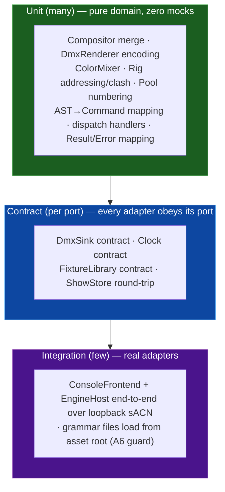

# Testability — What the Boundaries Unlock

`../lulcek` scored testability **⭐⭐⭐☆☆**: the deterministic clock (G3) makes the
render path *theoretically* testable, but there is no test suite (A7) and the
two biggest logic sinks — value merging and DMX encoding — can only run against
a live universe buffer and (for output) the network.

This architecture is designed **test-first**. The rule of thumb: *the valuable
logic lives in pure functions of injected inputs, and the I/O lives behind ports
you can fake.* This document shows the resulting test pyramid and works through
concrete examples.

---

## Why it becomes testable

| What you want to test | Today | Under this design |
|-----------------------|-------|-------------------|
| HTP/LTP merge | build a `Frame`, but merge is entangled with the single-`HSV` conflation (A2) | `Compositor::compose(layers, time)` — pure, returns a `FrameState` value |
| DMX encoding (values→bytes) | only via `Fixture::Resolve` writing into a live `Universe` buffer through raw pointers | `DmxRenderer::render(rig, frameState)` — pure, returns an immutable `DmxFrame` |
| HSV→RGB(+W), virtual dimmer (A9) | inside `ColorCell::Resolve`, needs bound parameters | `ColorMixer` free functions on plain values |
| Command → action | `CommandExecutor` needs a whole `Engine` | executor maps `AST → App::Command`; assert the emitted `Command` vector — zero engine — or dispatch it at a spy `Engine` |
| A full tick, incl. output | needs sACN on the wire | build `Command`s + `RecordingDmxSink` + `ManualClock`; assert bytes, no network, no parser |
| Pool numbering (G7) | already unit-friendly | unchanged, now in `domain/show` |

The single move that unlocks the top two rows is the thesis: **the domain
computes values; a pure renderer turns values into an immutable frame; the wire
is an adapter.** No universe buffer to stand up, no pointers to wire, no network.

---

## The test pyramid



- **Unit (the bulk).** Pure domain — no ports, no doubles, just values in /
  values out. Fast, deterministic, the highest ROI. These are impossible to
  write cleanly today.
- **Contract (one suite per outbound port).** A single parametrised suite runs
  against *every* implementation of a port — real and fake — so
  `RecordingDmxSink` and `SacnDmxSink` are both proven to honour the `DmxSink`
  contract. This is what lets you trust a fake in the unit tier.
- **Integration (a handful).** The composition root wired with real adapters,
  driven end-to-end (loopback sACN, real grammar files). Guards the wiring and
  the asset-path fix (A6).

---

## Worked examples

### 1 — Compositor merge (unit, no doubles)

Proves the value-slot fix (A2): a bright HTP intensity from a low layer must
**not** drag a stale hue over a high LTP color.

```cpp
TEST(Compositor, HtpIntensityDoesNotOverrideLtpColor) {
    FakeLayer low  (/*prio*/  10);
    FakeLayer high (/*prio*/ 100);
    low .set(fid(1), Intensity{1.0f});                 // bright, HTP
    high.set(fid(1), ColorValue{.hue = 240, .sat = 1}); // blue, LTP

    Compositor comp;
    FrameState fs = comp.compose({&low, &high}, TimeContext{});

    const FixtureState& s = *fs.get(fid(1));
    EXPECT_EQ(s.intensity, 1.0f);      // HTP kept the bright intensity
    EXPECT_EQ(s.color->hue, 240.f);    // LTP kept blue — no drag from intensity
}
```

### 2 — DmxRenderer encoding (unit, no buffer wiring)

The logic that today only runs through `Parameter::WriteRaw` into a live buffer.

```cpp
TEST(DmxRenderer, EncodesRgbFixtureAtItsAddress) {
    Rig rig;
    auto id = rig.patch(Personalities::rgb8(), UniverseId{8},
                        /*count*/1, {.startChannel = 93}).value().front();

    FrameState fs;
    fs.contribute(id, {.color = ColorValue{.hue = 0, .sat = 1},   // red
                       .intensity = 1.0f});

    DmxFrame frame = DmxRenderer{}.render(rig, fs);

    const auto& u8 = frame.universe(UniverseId{8});
    EXPECT_EQ(u8[92], 255);  // R  (channel 93, 0-based 92)
    EXPECT_EQ(u8[93], 0);    // G
    EXPECT_EQ(u8[94], 0);    // B
}
```

No `Universe`, no `setBuffer`, no copy-ctor pointer rewiring — just a value in
and 512 bytes out.

### 3 — AST → Command mapping (unit, no engine at all)

Proves the front-end→engine decoupling: the console's translator emits `Command`
*values*, so it is tested with **no engine** — just assert the data it produces.

```cpp
TEST(AstToCommand, SelectThenAtEmitsSelectAndSetIntensity) {
    std::vector<App::Command> cmds = Console::AstToCommand{}
                                         .map(parseToAst("1 thru 4 + 7 at 50"));

    ASSERT_EQ(cmds.size(), 2u);
    auto& sel = std::get<App::Select>(cmds[0]);
    EXPECT_EQ(sel.sel, Selector::range(1, 4).plus(7));
    EXPECT_FLOAT_EQ(std::get<App::SetIntensity>(cmds[1]).level01, 0.5f);   // "at 50"
}
```

If you'd rather exercise the whole front-end, dispatch the mapped commands at a
spy engine and assert the recorded stream — still no domain, no network:

```cpp
struct SpyEngine : App::Engine {
    std::vector<App::Command> got;
    Result<App::CommandResult> dispatch(const App::Command& c) override {
        got.push_back(c); return App::Ack{};
    }
    const Domain::FrameState& state() const override { static Domain::FrameState fs; return fs; }
    void renderTick() override {}
};
```

### 4 — A full tick with fakes (unit-ish, still no network)

```cpp
TEST(EngineService, TickRendersAndSendsOneFrame) {
    auto sink  = std::make_unique<RecordingDmxSink>();
    auto* rec  = sink.get();
    auto host  = Api::EngineBuilder{}
                     .withBuilderLibrary()
                     .withSink(std::move(sink))
                     .withClock(std::make_unique<ManualClock>(/*dt*/0.025f))
                     .build();
    auto& eng = host.engine();

    // Commands built directly — no console, no parser in this test.
    ASSERT_TRUE(eng.dispatch(App::Patch{"RGB", UniverseId{8}, 93}));
    ASSERT_TRUE(eng.dispatch(App::Select{ Selector::range(1, 93) }));
    ASSERT_TRUE(eng.dispatch(App::SetIntensity{1.0f}));
    host.renderTick();

    ASSERT_EQ(rec->frames().size(), 1u);
    EXPECT_EQ(rec->frames().back().universe(UniverseId{8})[92 + 2], /*B at full white*/ 255);
}
```

### 5 — DmxSink contract (contract tier)

One suite, every implementation. Instantiated for `RecordingDmxSink` and (in the
adapter build) `SacnDmxSink` pointed at loopback.

```cpp
template <class MakeSink>
struct DmxSinkContract : testing::Test { MakeSink make; };
TYPED_TEST_SUITE_P(DmxSinkContract);

TYPED_TEST_P(DmxSinkContract, SendAfterConfigureSucceeds) {
    auto sink = this->make();
    sink->configure(SinkConfig{.sourceName = "test"});
    EXPECT_TRUE(sink->send(DmxFrame::blackout({UniverseId{1}})));
}
// + send-before-configure behaviour, multi-universe, idempotent blackout...
```

### 6 — Asset-path regression (integration)

Directly guards `../lulcek` A6 — the CWD-relative grammar path that only
resolved from the repo root.

```cpp
TEST(ConsoleFrontend, LoadsGrammarFromInjectedAssetRootNotCwd) {
    auto assets = AssetPaths::relativeTo(testBinaryDir());  // not "./include/..."
    // running from a temp CWD must still find the grammar:
    fs::current_path(fs::temp_directory_path());
    auto host = Api::EngineBuilder{}.withBuilderLibrary().build();
    Api::ConsoleFrontend console(host.engine(), assets);   // asset root → front-end
    EXPECT_FALSE(console.run("clear").empty());
}
```

---

## Determinism & fixtures

- **`ManualClock`** makes every render reproducible frame-for-frame — the
  formal version of G3. Effects/playback tests advance the clock by hand and
  assert exact per-frame output.
- **`Personalities::` test factory** — canned `Personality` values (rgb8,
  rgbw8, dimmer, mover16) so encoding tests read as data, not setup.
- **Golden frames** — for complex rigs, snapshot a `DmxFrame` to a small fixture
  file and diff; because rendering is pure, goldens are stable.

---

## Suggested tooling

| Concern | Choice | Note |
|---------|--------|------|
| Framework | GoogleTest or Catch2 | GTest gives typed/parametrised suites for the contract tier |
| Build | `add_subdirectory(tests)`, `enable_testing()`, CTest | one test target per ring (`test_domain`, `test_app`, `test_adapters`) mirrors the link graph |
| CI | build + `ctest` on every push | the deterministic core means no flakiness from timing/network |
| Coverage focus | `domain/compose`, `domain/render`, `domain/rig`, `app` dispatch handlers, `api/console` AST→Command mapping | the highest-logic-density areas |

> **North star:** `test_domain` and `test_app` link **only** `le_domain` /
> `le_app` — no `utils_net`, no `synparser`, no sockets. If a domain test needs
> to link the network to compile, a boundary has leaked and the test suite is
> the first place it shows up.
</content>
