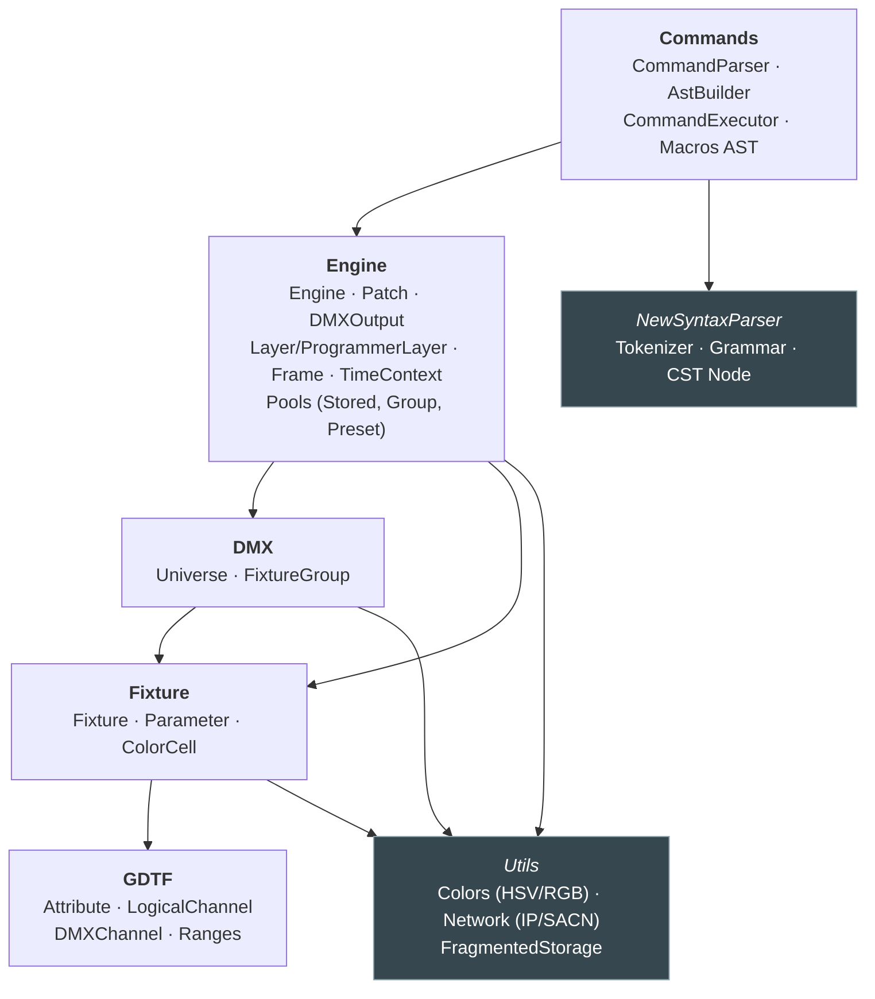
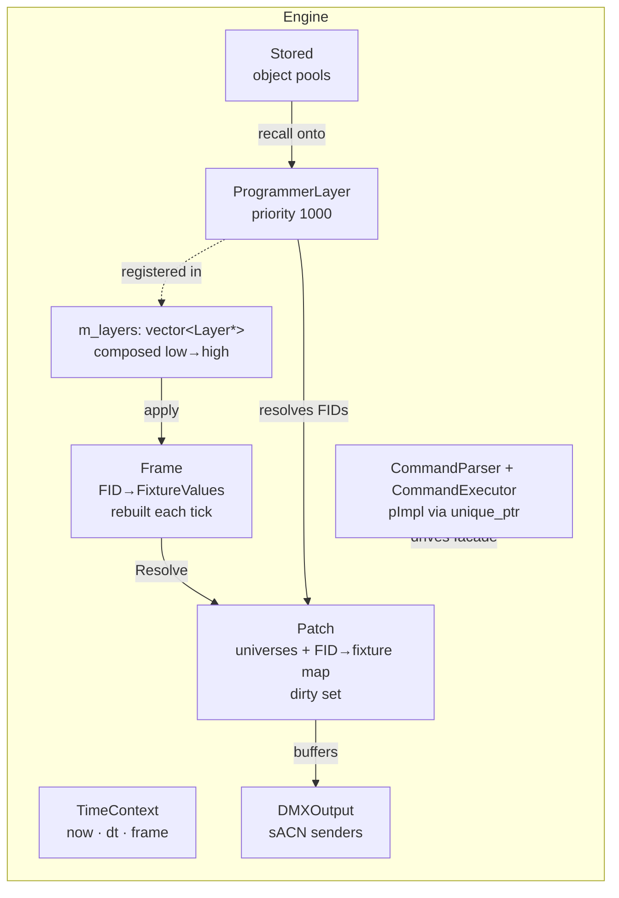
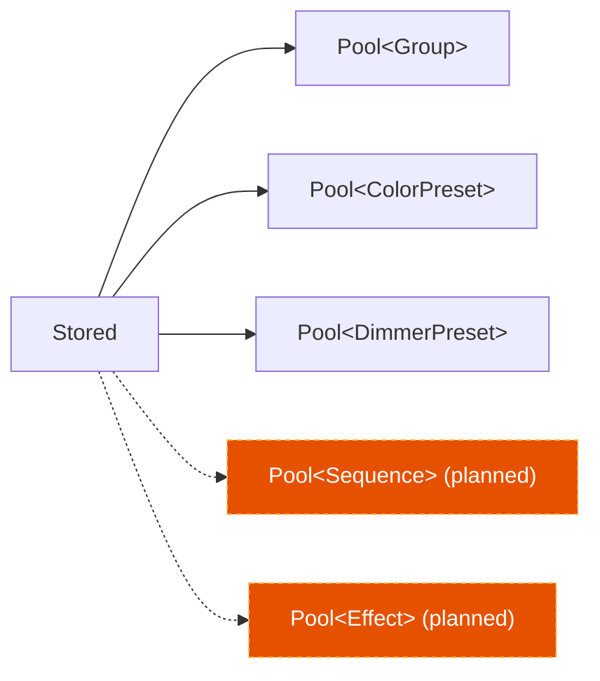
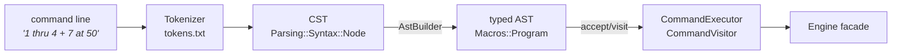
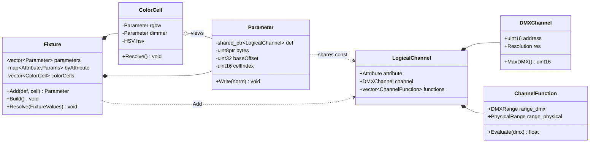
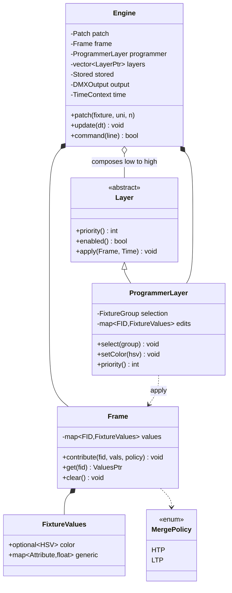
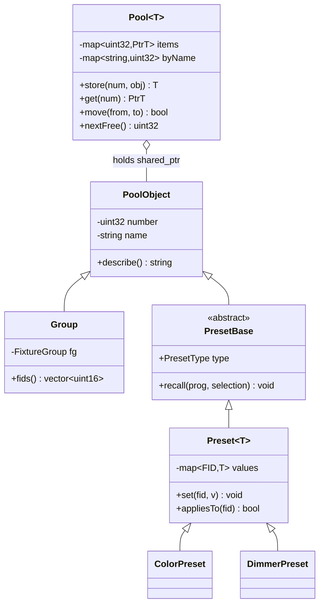
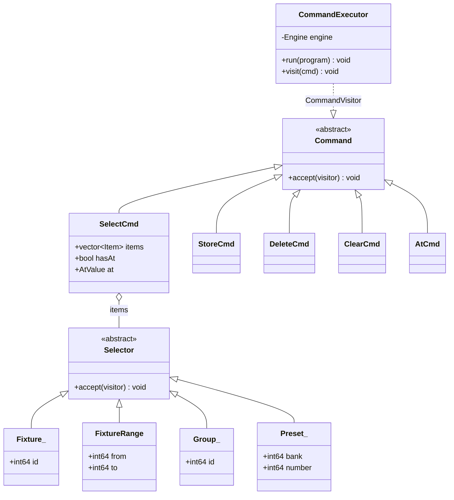
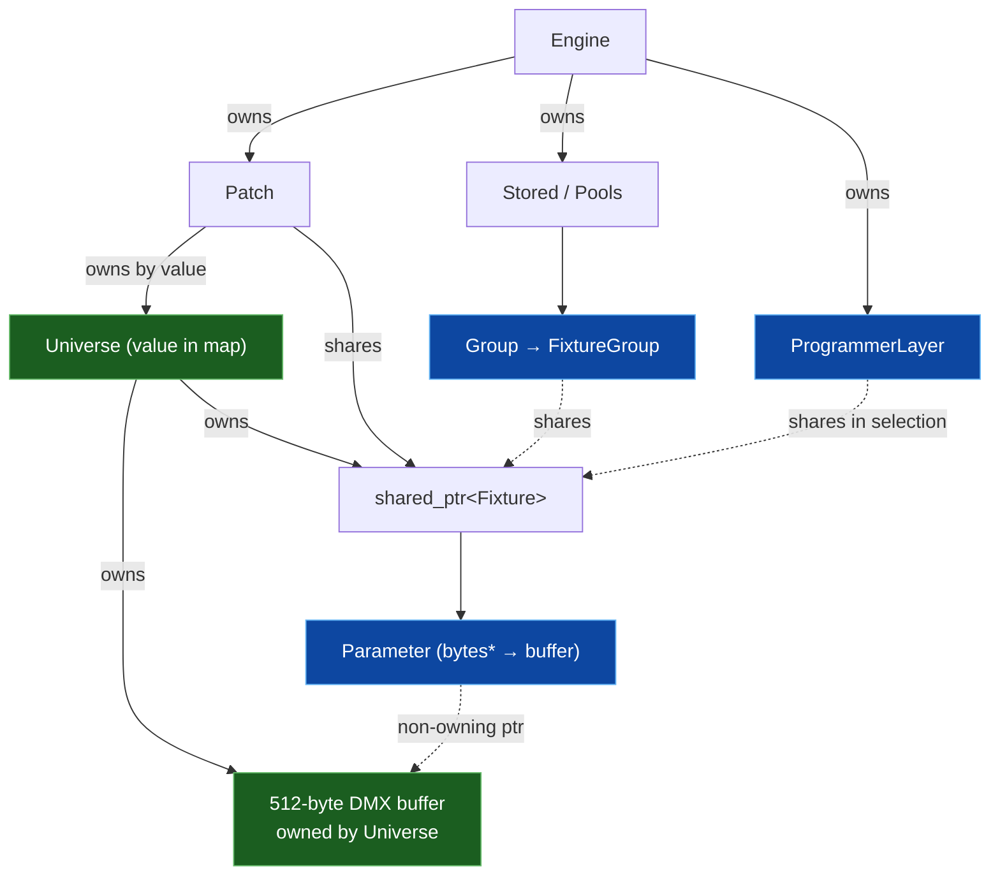

# Architecture — Zoom Levels

This document walks from the outside in: **context → modules → components →
classes**, then covers **ownership & lifetime**. Each level adds detail without
contradicting the one above it.

- [Level 1 — Context](#level-1--context) *(see [README](README.md))*
- [Level 2 — Layered modules](#level-2--layered-modules)
- [Level 3 — Components per module](#level-3--components-per-module)
- [Level 4 — Class diagrams](#level-4--class-diagrams)
- [Ownership & lifetime](#ownership--lifetime)

---

## Level 2 — Layered modules

The codebase is a clean **dependency stack**: higher layers depend on lower
ones, never the reverse. GDTF is the immutable foundation; Commands is the thin
text skin on top.

**Reading it:** a change to a GDTF definition can ripple up through everything;
a change to Commands touches nothing below Engine. That directionality is the
single most important structural property of the project — it is respected
consistently.

### Responsibilities

| Module | Role | Key insight |
|--------|------|-------------|
| **GDTF** | Immutable, shared channel *descriptions* | Flyweights — many fixtures share one `const LogicalChannel` via `shared_ptr` |
| **Fixture** | Live objects that *point into* a universe buffer | Own **no bytes**; stateless sinks (`Resolve()` writes and forgets) |
| **DMX** | The 512-channel universe + named selections | `Universe` **is-a** `FragmentedStorage`; `FixtureGroup` is a pure selection |
| **Engine** | Orchestration: patch → compose → resolve → output | Non-tracking render loop; state lives in **layers** and **pools** |
| **Commands** | Text → typed AST → Engine actions | Decoupled parse/build/execute via the visitor pattern |

---

## Level 3 — Components per module

### Engine internals

### Pools (the show's stored objects)

Each `Pool<T>` is a numbered slot map (`uint32_t → shared_ptr<T>`) with a
name index, `nextFree()` gap-finding, and `store/get/remove/move/rename`.

### Command subsystem

The grammar (`commands.syn`) and token defs (`commands.txt`) are **external data
files**, so the console language can evolve without recompiling.

---

## Level 4 — Class diagrams

### Fixture rendering path (GDTF → Fixture → DMX)

### Composition core (layers, frame, engine)

### Stored objects (pools & presets)

### Command AST (visitor pattern, auto-generated)

> The `Macros::` AST is **generated** from `commands.spec` by `gen_ast.py`
> (header carries an "AUTO-GENERATED — do not edit" banner). The grammar,
> tokens, and AST spec are three coordinated data files.

---

## Ownership & lifetime

Who owns the heap, and who merely *points*, is the crux of understanding this
engine. Getting it wrong is the main safety risk (see [ASSESSMENT](ASSESSMENT.md)).

**Key facts**

- A **`Universe`** owns its 512-byte buffer *and* the `shared_ptr<Fixture>`s placed in it.
- A **`Fixture`**'s `Parameter`s and `ColorCell`s hold **raw, non-owning pointers**
  into that buffer and into the fixture's own parameter vector.
- `FixtureGroup`, `Group`, and `ProgrammerLayer::selection` **share** fixtures
  (`shared_ptr`) but own none — they are pure selections.
- `m_layers` is a `vector<Layer*>` of **raw** pointers; the programmer is a member,
  external layers added via `addLayer()` are borrowed (no ownership transfer).

> ⚠️ Because `Parameter::bytes` and `ColorCell` pointers are non-owning and are
> re-wired on placement/copy, fixture **copy semantics matter**. `Fixture`
> correctly rebuilds its index in the copy ctor / assignment so pointers aim at
> *its own* parameters. This is the subtle bit the code gets right.
