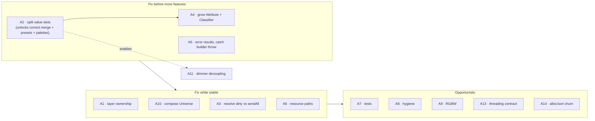

# Architecture Assessment

An honest read of what LightEngine does well, what it doesn't, and how much each
weakness matters. Findings are grounded in the code as it stands on the
`commands` branch.

## Severity scale

| Badge | Level | Meaning |
|-------|-------|---------|
| 🔴 | **High (S3)** | Correctness/safety risk, or will actively block the roadmap |
| 🟠 | **Medium (S2)** | Notable design debt; fix before the surrounding area grows |
| 🟡 | **Low (S1)** | Hygiene, polish, or a known-and-acceptable simplification |

## Scorecard by dimension

| Dimension | Rating | One-line verdict |
|-----------|:------:|------------------|
| Modularity / layering | ⭐⭐⭐⭐⭐ | Strict, acyclic dependency stack — the standout strength |
| Separation of concerns | ⭐⭐⭐⭐☆ | Parse/build/execute and state/render splits are excellent |
| Memory safety | ⭐⭐⭐½ | Non-owning pointers handled carefully, but raw `Layer*` + buffer aliasing are landmines |
| Error handling | ⭐⭐☆☆☆ | Silent failures and one uncaught `throw` path |
| Extensibility | ⭐⭐⭐⭐☆ | Seams for effects/playback/protocols are designed in; some are stubs |
| Testability | ⭐⭐⭐☆☆ | Deterministic clock is great; no actual test suite |
| Documentation | ⭐⭐⭐⭐⭐ | Header prose + `docs/ENGINE.md` are unusually good |
| Performance | ⭐⭐⭐☆☆ | Fine for the scale; per-frame allocations & re-sort waste cycles |

---

## What is good

### G1 — Strict, acyclic layering
`GDTF ← Fixture ← DMX ← Engine ← Commands` with **no upward or cyclic
dependencies**. Every `#include` respects the stack. This is the property that
makes the rest of the codebase legible and is genuinely well executed.

### G2 — The non-tracking frame model
Rebuilding the `Frame` from scratch each tick and treating fixtures as
**stateless sinks** is the right call for a compositor. It eliminates a whole
class of "stuck value" bugs and makes layer composition (programmer-over-playback)
emerge for free from priority ordering + merge policy.

### G3 — Deterministic, injectable clock
`update(dt)` takes the delta from the caller; `TimeContext` is threaded into
every `apply()`. The render path has no hidden global clock, so frames are
**reproducible and testable**. Small design choice, big payoff.

### G4 — Clean command pipeline
Text → tokens → CST → typed AST → visitor-driven executor, with the grammar,
tokens, and AST spec living in **external data files** (and the AST *generated*
from spec). The `Engine` hides the parser/executor behind `unique_ptr` (pImpl),
keeping heavy parser headers out of the public API. Textbook decoupling.

### G5 — Flyweight GDTF definitions
`Parameter` shares a `shared_ptr<const LogicalChannel>`. 273 fixtures in the demo
share a handful of channel descriptions. Correct use of the pattern.

### G6 — Correct fixture copy semantics
`Fixture`'s copy ctor / assignment **rebuild** the attribute index and color
cells so their raw pointers aim at the *copy's* parameters, not the source's.
This is the easiest thing to get wrong with non-owning internal pointers, and the
code gets it right (`src/Fixture/Fixture.cpp:34-56`).

### G7 — Generic, reusable `Pool<T>`
One template covers every stored object type (groups, presets, and future
sequences/effects) with slot numbering, name indexing, and `move`/`rename`.

---

## What could be improved

### 🟠 A2 — Intensity and color are conflated in one `HSV`
`FixtureValues::color` is a single `HSV`, so intensity (V) rides *with* hue/sat
through the HTP/LTP merge (`src/Engine/Frame.cpp:17-23`). Real consoles keep
**intensity on an HTP channel** and **color on an LTP channel** independently.
Today an HTP intensity bump can drag along a stale hue. The roadmap already names
the fix ("split `FixtureValues` into per-category slots + a `Classifier`").
**Impact:** incorrect merges once more than one color-producing layer exists.
**Fix:** separate `intensity`, `color`, `position`, `beam` slots on `FixtureValues`.

### 🟠 A1 — Layer lifetime is unmanaged raw pointers
`m_layers` is `vector<Layer*>`; `addLayer(Layer*)` borrows with no ownership or
lifetime contract, and the programmer is both a member *and* an entry in the
vector. A caller that adds a stack/temporary layer gets a **dangling pointer**
with no diagnostic. **Fix:** document the borrow contract explicitly, or hold
`unique_ptr`/`shared_ptr`, or a small `LayerHandle`.

### 🟠 A3 — Dirty-tracking is vestigial
`Patch` carefully maintains a `m_dirty` universe set (`markDirty`/`clearDirty`)
and `DMXOutput::update(dirty, patch)` exists to send only changed universes — but
`Engine::update()` calls `m_output.sendAll(patch)` every frame and then
`clearDirty()`. So the dirty machinery is **built but unused** on the hot path.
That is also *correct* for a continuous sACN source (it re-sends unconditionally),
which makes the dirty set dead weight. **Fix:** either delete the dirty set or
wire `DMXOutput::update` for a keyframe/on-change send mode and document which
policy is intended.

### 🟠 A4 — The attribute vocabulary is a stub
`GDTF::Attribute` is only `{DIMMER, VDIMMER, COLOR_R/G/B/W}`. The whole `generic`
attribute path (`FixtureValues::generic`, `Fixture::Resolve` generic loop) is
built for "pan, tilt, gobo, …" that **don't exist in the enum yet**, and
`VDIMMER` is defined but unreferenced. **Impact:** movers/beam fixtures can't be
represented; the generic path is untested dead-ish code. **Fix:** grow the
enum + a `Attribute → category` classifier (pairs naturally with A2).

### 🟠 A5 — Error handling is thin and inconsistent
Three different failure styles coexist: `Engine::command()` returns `false` with
**no diagnostic**; `CommandParser::parse()` returns an empty `Program` on any lex
*or* parse error (indistinguishable); and `AstBuilder` **`throw`s
`std::runtime_error`** on an unexpected node — uncaught anywhere, so a
grammar/spec drift crashes the process. **Fix:** a small `Result`/`expected` type
carrying an error message, and catch/convert builder exceptions at the `command()`
boundary.

### 🟠 A10 — `Universe` inherits (not composes) `FragmentedStorage`
`Universe : public FragmentedStorage<Fixture,512>` leaks the base `add()`, which
the header then *warns you not to call* ("Use addFixture()… only the wrappers
wire the buffer"). A public API you must not use is a leaky abstraction and a
foot-gun. **Fix:** make the storage a private member (composition) and expose
only the wired `addFixture*` surface.

### 🟠 A6 — CWD-dependent resource paths
Grammar/token files are loaded via relative paths (`include/LightEngine/Commands/
data/commands.txt`) that only resolve when run from the repo root. **Fix:**
resolve against an install/asset root or embed the grammar.

### 🟡 A11 — Dimmer intent is coupled to color existence
`storeDimmerPreset` reads `v.color->v` and skips fixtures with no `color`
(`src/Engine/Engine.cpp:84-86`); `applyIntensity` allocates an `HSV` just to hold
V. Intensity has no independent representation. Resolves naturally once A2 splits
the slots.

### 🟡 A9 — Naive RGBW white mixing
`w.Write((1 - s) * V)` is a first-order approximation (the code says so). Fine as
a placeholder; real color mixing needs per-fixture calibration.

### 🟡 A7 — No test suite
The two `examples/` are effectively smoke tests printing to stdout; there's no
assertion framework or CI. The deterministic clock (G3) makes the render path
*highly* testable — the harness is just missing. **Fix:** add unit tests around
`Frame::contribute` (merge policies), `Parameter::Write` (range → DMX), and
`Pool<T>` numbering.

### 🟡 A12 — Stubs advertised as seams
`FixtureLibrary` is an empty class; GDTF import, `PlaybackLayer`, `EffectEngine`,
and palettes are commented TODOs. This is honest roadmap signposting rather than
a defect — flagged only so readers don't mistake the seams for finished features.

### 🟡 A8 — Repository hygiene
A stray 3-byte `brightness` file at the repo root, `CMakePresetsold.json`, a
one-line stub `README.md`, and scattered commented-out code (`Pool::contains`
duplicate, disabled `main.cpp` loop). Low effort, quick wins.

### 🟡 A13 — Concurrency model undocumented
The engine is single-threaded by assumption. A UI thread calling `command()`
while a render thread calls `update()` would race the programmer's `edits`/frame
with no guard. **Fix:** state the single-thread contract, or add a command queue.

### 🟡 A14 — Per-frame allocation churn
`Frame::clear()` + rebuild uses `std::map<uint16_t, FixtureValues>` (node
allocations) every tick, and `m_layers` is `stable_sort`ed each frame though it
rarely changes. Negligible at demo scale (~273 fixtures), but wasteful at 40 Hz.
**Fix:** reuse frame storage across ticks; sort layers only on mutation.

---

## Priority: what to fix first

**Bottom line:** the *bones are excellent* — the layering (G1), the non-tracking
compositor (G2), and the command pipeline (G4) are the kind of decisions that pay
off for years. The debt is concentrated in **value modeling** (A2/A4/A11) and
**robustness** (A1/A5/A10). Address the value-slot split first: it is the
keystone that the merge correctness, preset fidelity, and the palette roadmap all
depend on.
