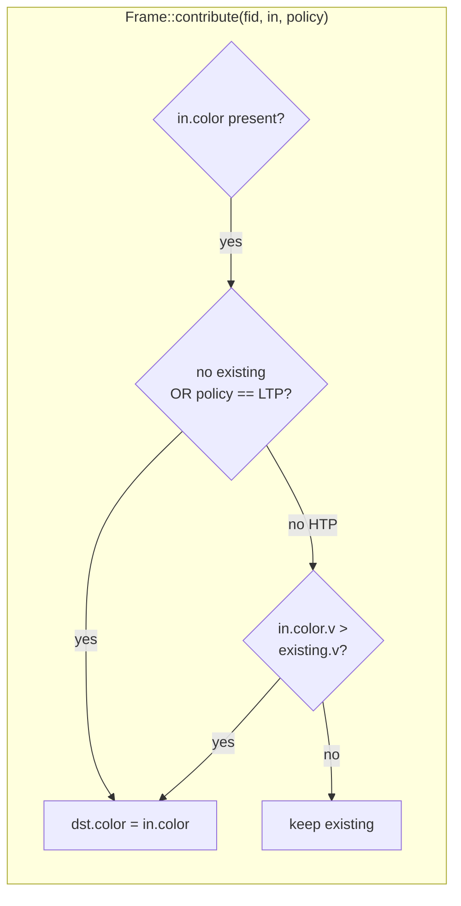
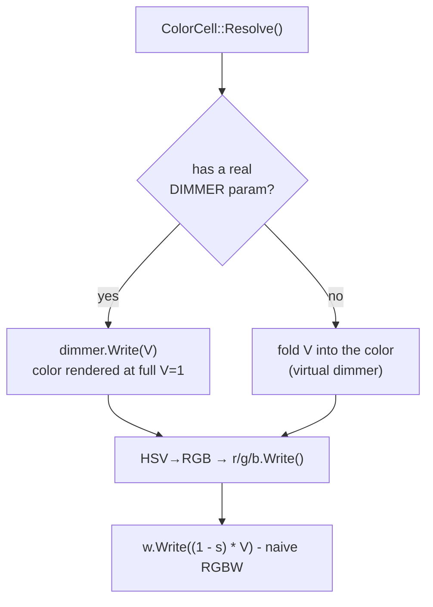
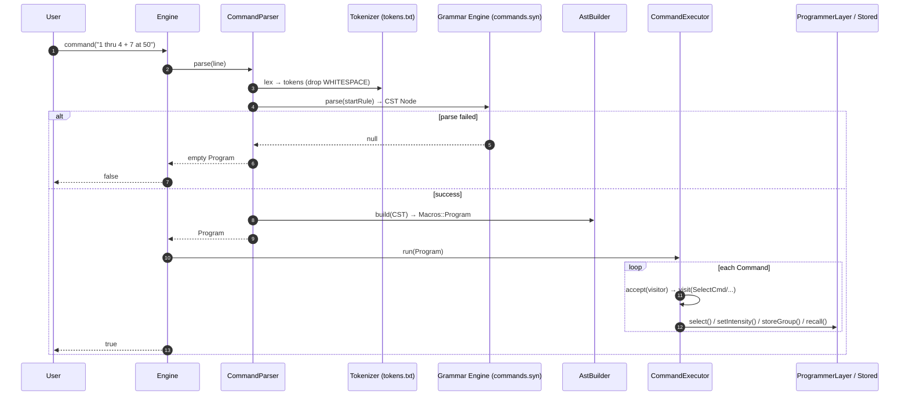
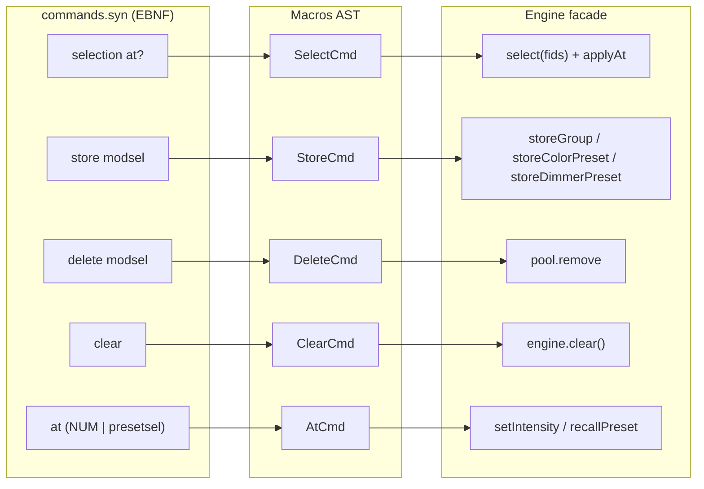
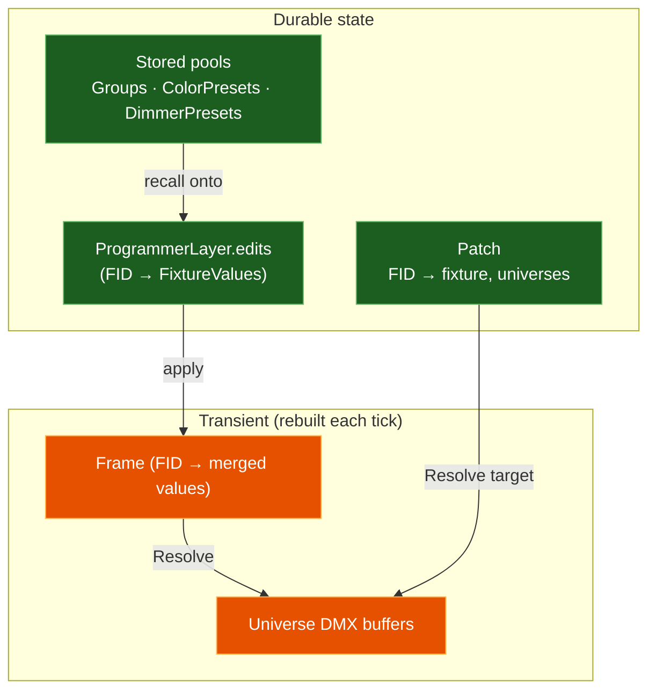

# Runtime Pipelines

LightEngine has exactly **two** things that move at runtime:

1. the **render pipeline** — `Engine::update(dt)`, run every frame, and
2. the **command pipeline** — `Engine::command(line)`, run per keystroke/line.

They meet at the *programmer layer*: commands mutate stored state and the
programmer; the render loop reads it all and paints DMX.

---

## 1. The render pipeline (per frame)

```mermaid
sequenceDiagram
    autonumber
    participant App as Caller (~40 Hz)
    participant E as Engine
    participant T as TimeContext
    participant P as Patch / Universes
    participant L as Layers (low→high)
    participant F as Frame
    participant Fx as Fixtures
    participant O as DMXOutput (sACN)

    App->>E: update(dt)
    E->>T: now += dt; ++frame
    E->>P: blackout()  (zero every buffer)
    E->>F: clear()
    E->>L: stable_sort by priority()
    loop each enabled layer
        E->>L: apply(Frame, TimeContext)
        L->>F: contribute(fid, values, HTP|LTP)
    end
    loop each fid in Frame
        E->>Fx: Resolve(mergedValues)
        Fx->>P: write DMX bytes into buffer
    end
    alt output enabled (setIP called)
        E->>O: sendAll(patch)
        O-->>App: sACN packets on the wire
    end
    E->>P: clearDirty()
```

### Why it composes: the merge

Layers are sorted **low → high priority** and applied in that order, so a
higher-priority layer's write lands *on top of* a lower one's. The combine rule
per value is the `MergePolicy`:



| Policy | Meaning | Used for |
|--------|---------|----------|
| **HTP** | Highest-Takes-Precedence (max wins) | intensity |
| **LTP** | Latest/priority-Takes-Precedence (last wins) | color, position |

Consequence — *"programmer over playback" falls out for free*: grab a fixture on
the programmer (priority 1000) and its LTP color overrides a running cue; release
it and the lower layer shows through, untouched, because neither layer clobbered
the other's *stored* intent — only the transient Frame decided who won.

> ⚠️ **Design smell:** color and intensity are bundled in a single `HSV`
> (`FixtureValues::color`). HTP therefore compares `V` and drags hue/sat along
> with the brighter intensity. Proper consoles keep intensity (HTP) and color
> (LTP) on *independent* channels. The ENGINE.md roadmap acknowledges this
> ("split `FixtureValues` into per-category slots"). See
> [ASSESSMENT](ASSESSMENT.md#a2).

### The virtual-dimmer rule (inside `ColorCell::Resolve`)



This is the single place the HSV→DMX conversion lives — a genuinely nice
consolidation.

---

## 2. The command pipeline (per line)



### Grammar → AST → action mapping



**Selector semantics** (`CommandExecutor::resolveSelection`): items apply left to
right, `+` unions (dedup, order-preserving), `-` subtracts. Preset addressing is
`bank.number` where **bank 1 → dimmer**, **bank 2 → color**.

> ⚠️ `AstBuilder` `throw`s `std::runtime_error` on an unexpected node shape, and
> nothing in `Engine::command()` catches it — a grammar/spec mismatch becomes an
> uncaught exception rather than a graceful `false`. See
> [ASSESSMENT](ASSESSMENT.md#a5).

---

## Where state actually lives

A useful cross-cut: nothing durable lives in the Frame or the fixtures. It's all
in **layers** and **pools**.


