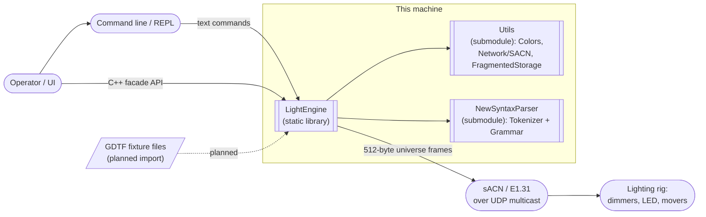
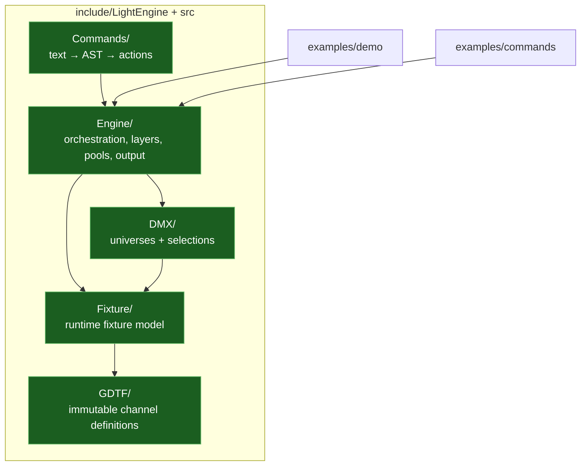

# LightEngine — Architecture Documentation

> A small, layered **DMX lighting console engine** in modern C++ (C++23).
> Patch fixtures into DMX universes, drive them through composable layers,
> resolve everything to raw DMX each frame, and stream it out over sACN.

This folder documents the architecture of LightEngine at several levels of zoom,
with an emphasis on **visual (Mermaid) representation**, and closes with a
frank assessment of what is well built and what should be improved.

---

## Documents

| Doc | What's inside |
|-----|---------------|
| **[README.md](README.md)** (this file) | System context, the one-paragraph mental model, module map |
| **[ARCHITECTURE.md](ARCHITECTURE.md)** | Zoom levels 1→4: context → modules → components → classes, plus ownership & lifetime |
| **[PIPELINES.md](PIPELINES.md)** | The two runtime pipelines — the per-frame render loop and the text-command pipeline — as sequence diagrams |
| **[ASSESSMENT.md](ASSESSMENT.md)** | Strengths, weaknesses, and a severity-scored issues table |

---

## The mental model in one line

```
layers (persistent state) --apply()--> Frame (transient) --Resolve()--> DMX buffer --sACN--> wire
```

Every `Engine::update(dt)`:

1. **advance the clock** — bump `TimeContext` (`now`, `dt`, `frame`)
2. **blackout** — zero every universe buffer
3. **compose** — each layer, low→high priority, writes into a fresh `Frame`
4. **resolve** — push merged per-fixture values into each fixture's DMX bytes
5. **output** — if an IP is configured, stream every universe over sACN

Two invariants make this compose cleanly:

- **Fixtures are stateless sinks** — they render what they're handed and keep nothing between frames.
- **The Frame is transient** — rebuilt from scratch every tick; all durable state lives in *layers*.

## System context (C4 — Level 1)



## Module map (what lives where)



See **[ARCHITECTURE.md](ARCHITECTURE.md)** for the detailed breakdown of each module.

---

## At a glance

| Aspect | Detail |
|--------|--------|
| Language | C++23 |
| Build | CMake ≥ 3.16 (`LightEngine` lib + `LightEngine_demo`, `LightEngine_commands` execs) |
| Dependencies | `Utils`, `NewSyntaxParser` (git submodules under `lib/`) |
| Output protocol | sACN / E1.31 (Art-Net & raw DMX are seams, not yet implemented) |
| Fixture source | Hand-built via `FixtureBuilder`; GDTF import is stubbed |
| Threading | Single-threaded; caller owns the frame clock |
| Tests | None as a framework — the two `examples/` act as smoke tests |
| Source size | ~3.3k LOC across `include/` + `src/` (excludes submodules) |
